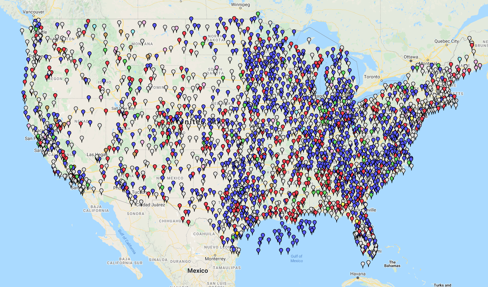

# public-wind-data
public wind data download, parsing, and visualization

# Get location of ASOS stations 

## Data Source
https://www.faa.gov/air_traffic/weather/asos/

## Legend: weather station types
<ul class="legend">
	<li>AWOS A: </li>
	<li>AWOS A/V: </li>
	<li>AWOS I: </li>
	<li>AWOS II: </li>
	<li>AWOS III: </li>
	<li>AWOS IIIP: </li>
	<li>AWOS IIIT: 
	<li>AWOS IIIP/T: </li>
	<li>ASOS: </li>
	<li>AWSS: </li>
	<li>AWOS IV: </li>
	<li>Misc.: </li>
</ul>

## Visualization

[link](https://www.google.com/maps/d/u/0/edit?mid=1IswrBrS0yaibsZCY8s79o5_EWEk-67Az&usp=sharing)
<iframe src="https://www.google.com/maps/d/u/0/embed?mid=1IswrBrS0yaibsZCY8s79o5_EWEk-67Az" width="640" height="480"></iframe>
